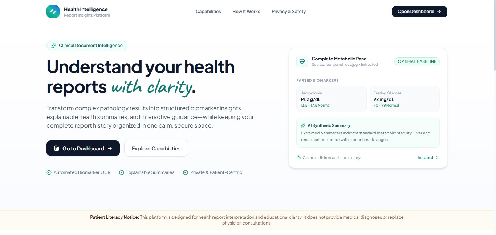
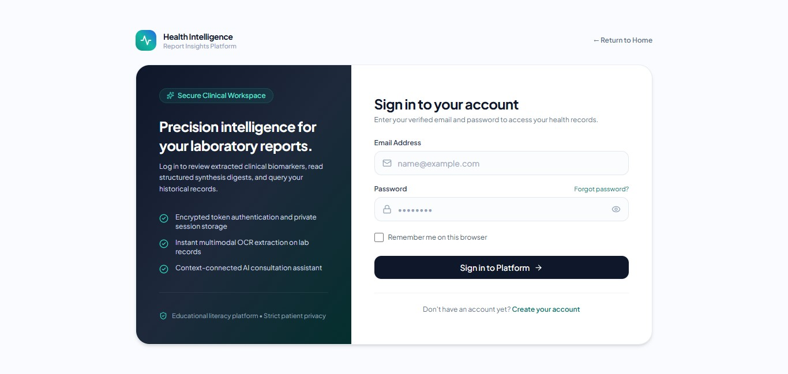
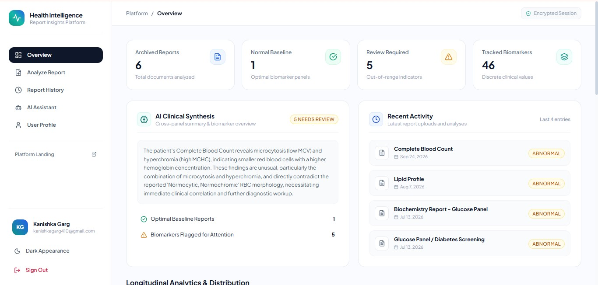
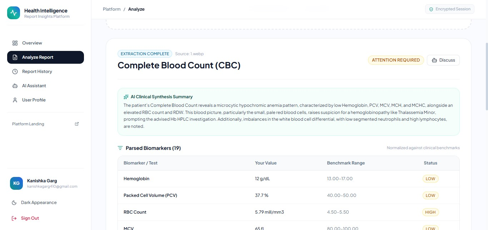
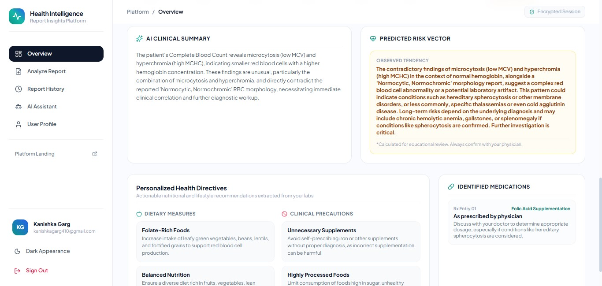
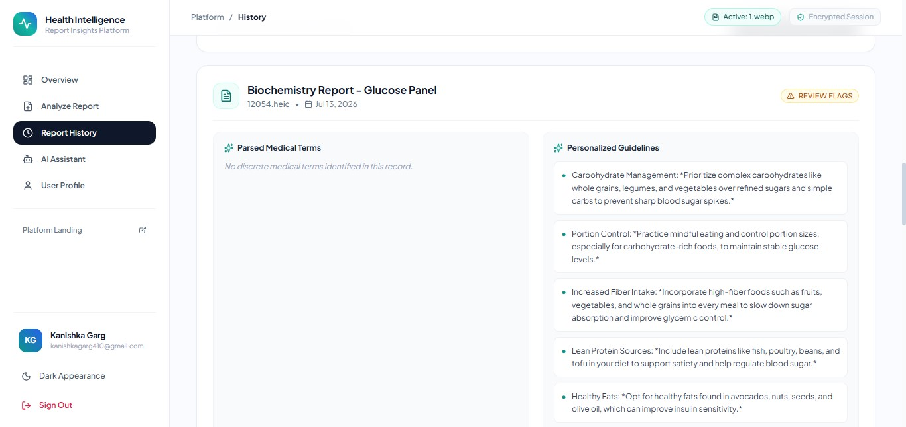
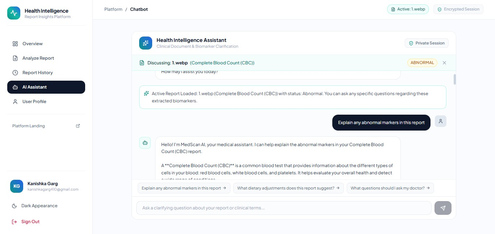

# 🩺 Health Intelligence & Report Insights Platform

<p align="center">

### AI-Assisted Health Report Processing & Insights

A full-stack health intelligence platform that combines **Tesseract OCR** and **Google Gemini AI** to process uploaded health reports, extract structured information, generate AI-assisted insights, and support conversational exploration.

<br/>

<a href="https://med-scan-topaz.vercel.app/">
  
</a>

</p>

---

## ✨ Overview

The **Health Intelligence & Report Insights Platform** is a full-stack web application designed to help users process and understand information contained within health reports.

The platform combines **Tesseract OCR** for report text extraction with **Google Gemini AI** for AI-assisted analysis, connecting document processing, structured information, report history, and conversational interaction within a single workflow.

### Platform Capabilities

* 📄 Health report upload and processing
* 🔍 OCR-based text extraction
* 🧠 AI-assisted report analysis
* 📊 Structured health insights
* 📜 Report history management
* 💬 Interactive health assistant
* 🥗 Personalized informational suggestions
* 🔐 JWT-based authentication
* 🌐 RESTful APIs

Testing achieved **90%+ OCR accuracy across 10+ tested reports**.

---

# 🚀 Core Features

## 📄 Health Report Processing

Users can upload supported health report images and initiate automated processing.

* JPG and PNG report support
* OCR-based text extraction
* Structured report information
* Automated report processing
* Report-linked analysis

### Processing Pipeline

```text
Report Upload
      ↓
Tesseract OCR
      ↓
Text Extraction
      ↓
Structured Report Data
      ↓
Gemini AI Analysis
      ↓
Health Insights
```

---

## 🧠 AI-Assisted Health Insights

Extracted report information is processed through **Google Gemini AI** to generate structured informational insights.

The platform can provide:

* Report summaries
* Important observations
* Abnormal-value indicators
* Health-related explanations
* General informational recommendations

---

## 📊 Report History

Authenticated users can access previously processed reports.

* Report archive
* Previous analysis access
* Report-linked insights
* User-specific report history
* Persistent report storage

---

## 💬 Health Assistant

The platform includes an interactive AI-assisted health assistant for discussing analyzed report information.

Users can:

* Ask questions about analyzed reports
* Understand health-related terminology
* Discuss report information conversationally
* Continue report-linked conversations

---

## 🥗 Personalized Informational Suggestions

The platform can generate informational suggestions based on analyzed report data, including:

* Dietary suggestions
* Lifestyle guidance
* Hydration suggestions
* Preventive health information

> **Disclaimer:** This platform is intended for educational and portfolio purposes. Generated information is informational and should not be treated as medical diagnosis or professional medical advice.

---

# 🔄 Application Workflow

```text
                         User
                          │
                          ▼
                 Upload Health Report
                          │
                          ▼
                 Express Backend
                          │
                          ▼
                    Tesseract OCR
                          │
                          ▼
                 Extracted Report Text
                          │
                          ▼
                      Gemini AI
                          │
                          ▼
                 AI-Assisted Insights
                          │
                          ▼
                    MongoDB Atlas
                          │
                          ▼
                 Dashboard + History
                          │
                          ▼
                  Health Assistant
```

---

# 🏗️ System Architecture

```text
                         ┌─────────────────┐
                         │      User       │
                         └────────┬────────┘
                                  │
                                  ▼
                         ┌─────────────────┐
                         │ React + Vite    │
                         │    Frontend     │
                         └────────┬────────┘
                                  │
                              REST API
                                  │
                                  ▼
                         ┌─────────────────┐
                         │ Node.js +       │
                         │ Express Backend │
                         └────────┬────────┘
                                  │
              ┌───────────────────┼───────────────────┐
              │                   │                   │
              ▼                   ▼                   ▼
       ┌─────────────┐     ┌─────────────┐     ┌─────────────┐
       │ JWT Auth    │     │ Tesseract   │     │  Gemini AI  │
       │             │     │ OCR         │     │             │
       └─────────────┘     └──────┬──────┘     └──────┬──────┘
                                  │                   │
                                  └─────────┬─────────┘
                                            ▼
                                  ┌─────────────────┐
                                  │ Report Analysis │
                                  └────────┬────────┘
                                           │
                                           ▼
                                  ┌─────────────────┐
                                  │  MongoDB Atlas  │
                                  └────────┬────────┘
                                           │
                                           ▼
                                  ┌─────────────────┐
                                  │ Report History  │
                                  └─────────────────┘
```

---

# 🖼️ Application Showcase

## 01 — Landing Page

The landing experience introduces the platform and guides users toward report analysis.

<p align="center">
  
</p>

---

## 02 — Authentication

JWT-based authentication provides secure access to protected application workflows.

<p align="center">
  
</p>

---

## 03 — Dashboard

The central workspace for accessing report analysis, insights, history, and the health assistant.

<p align="center">
  
</p>

---

## 04 — Report Analysis

Structured report information and AI-assisted analysis are presented through the results interface.

<p align="center">
  
</p>

---

## 05 — AI Synthesis

AI-generated report synthesis and health-related insights are presented through the analysis interface.

<p align="center">
  
</p>

---

## 06 — Report History

Previously processed reports can be accessed through the authenticated history interface.

<p align="center">
  
</p>

---

## 07 — Health Assistant

An interactive assistant for discussing analyzed report information and health-related terminology.

<p align="center">
  
</p>

---

# 🧰 Technology Stack

## Frontend

| Technology    | Purpose                       |
| ------------- | ----------------------------- |
| React.js      | Frontend application          |
| Vite          | Development and build tooling |
| Tailwind CSS  | UI styling                    |
| React Router  | Client-side routing           |
| Axios         | API communication             |
| Recharts      | Data visualization            |
| Framer Motion | UI animations                 |

## Backend

| Technology | Purpose                        |
| ---------- | ------------------------------ |
| Node.js    | Backend runtime                |
| Express.js | REST API framework             |
| Multer     | File upload handling           |
| JWT        | Authentication                 |
| REST APIs  | Frontend/backend communication |

## Database

| Technology    | Purpose                 |
| ------------- | ----------------------- |
| MongoDB Atlas | Cloud database          |
| Mongoose      | MongoDB object modeling |

## OCR & AI

| Technology       | Purpose                     |
| ---------------- | --------------------------- |
| Tesseract OCR    | Report text extraction      |
| Google Gemini AI | AI-assisted report analysis |

## Development & Deployment

* Git
* GitHub
* VS Code
* Postman
* MongoDB Compass
* Vercel
* Render

---

# 🌐 REST API

The backend provides authenticated REST APIs for the application's core workflows:

* User authentication
* Report upload
* Report processing
* Report history
* AI-assisted analysis
* Chat interactions

The application contains **10+ JWT-authenticated REST API endpoints** across its core workflows.

---

# 🔐 Authentication Flow

```text
Registration / Login
        ↓
    JWT Token
        ↓
Authenticated Frontend
        ↓
Authorization Header
        ↓
Protected Express Routes
        ↓
Report / AI Services
        ↓
MongoDB Atlas
```

---

# 🔬 Report Processing Pipeline

```text
1. User uploads a report.
        ↓
2. Backend receives the uploaded file.
        ↓
3. Tesseract OCR extracts report text.
        ↓
4. Extracted content is prepared for analysis.
        ↓
5. Gemini AI processes the extracted information.
        ↓
6. AI-assisted insights are generated.
        ↓
7. Report and analysis data are persisted.
        ↓
8. Results are displayed in the dashboard.
        ↓
9. Report becomes available through history.
        ↓
10. User can continue the discussion through
    the Health Assistant.
```

---

# 📊 Testing Highlights

* **90%+ OCR accuracy across 10+ tested reports**
* **10+ JWT-authenticated REST API endpoints**
* Report history across authenticated sessions
* Responsive interface across desktop and mobile layouts

---

# 🔒 Security

The platform implements several application-level security practices:

* JWT authentication
* Protected backend routes
* User-specific report access
* Password hashing
* Environment variable protection
* Protected REST APIs
* Secure API credential handling

> API keys, database credentials, JWT secrets, and other sensitive configuration values should be stored in environment variables and never committed to the repository.

---

# 📁 Project Structure

```text
health-intelligence-report-insights-platform/
│
├── frontend/
│   ├── src/
│   │   ├── components/
│   │   ├── pages/
│   │   ├── context/
│   │   ├── services/
│   │   └── utils/
│   ├── public/
│   └── package.json
│
├── backend/
│   ├── controllers/
│   ├── models/
│   ├── routes/
│   ├── middleware/
│   ├── services/
│   └── config/
│
├── Screenshots/
│   ├── landing.jpg
│   ├── login.jpg
│   ├── dashboard.jpg
│   ├── results.jpg
│   ├── summary.jpg
│   ├── history.jpg
│   └── AI_copliot.jpg
│
└── README.md
```

---

# ⚙️ Local Development

## 1. Clone the Repository

```bash
git clone YOUR_GITHUB_REPOSITORY_URL

cd YOUR_REPOSITORY_NAME
```

---

## 2. Backend Setup

```bash
cd backend

npm install

npm start
```

Backend:

```text
http://localhost:5000
```

Create:

```text
backend/.env
```

```env
PORT=5000
MONGO_URI=your_mongodb_connection_string
GEMINI_API_KEY=your_gemini_api_key
JWT_SECRET=your_secret_key
```

---

## 3. Frontend Setup

```bash
cd frontend

npm install

npm run dev
```

Frontend:

```text
http://localhost:5173
```

Create:

```text
frontend/.env
```

```env
VITE_API_URL=http://localhost:5000
```

> Never commit `.env` files or secret credentials to GitHub.

---

# ☁️ Deployment Architecture

```text
                 React + Vite
                     │
                     ▼
                   Vercel
                     │
                     ▼
              Node.js + Express
                     │
           ┌─────────┴─────────┐
           │                   │
           ▼                   ▼
      Tesseract OCR        Gemini AI
           │                   │
           └─────────┬─────────┘
                     │
                     ▼
                MongoDB Atlas
```

### Live Application

https://med-scan-topaz.vercel.app/

---

# 🔮 Future Improvements

* PDF report support
* Multilingual report processing
* Improved OCR preprocessing
* Expanded report formats
* Enhanced he
